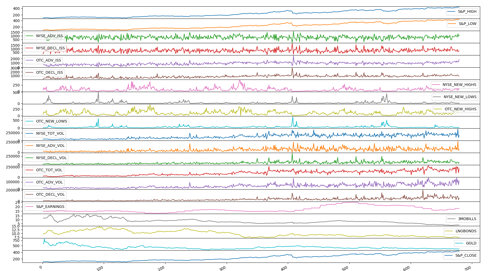

# Stock Price Forecasting
This repository is meant for the project material of the course **"Applied Machine Learning"** taught by **Prof. Madan Gopal.**

## S&P Close Prediction
In this dataset, we had to predict the value of S&P Close based on 21 other features. 

## Dataset

Dataset included the Stock Prices from `1/4/1980 – 12/4/1992`

## Data Pre-Processing

The data was processed by normalising the data with the help of `Z_Score`. `Z_score` is the same as defined in Statistics.

### Feature Analysis
There are 21 features in our dataset. The stocks market parameters listed in
the dataset are listed from `1/4/1980 – 12/4/1992.` Feature to be predicted is
S&P Close. There are total 679 examples given in the dataset (roughly 4
example per month).

#### 1.S&P_HIGH
> It’s a parameter of Standard & Poor listed 500 biggest companies of America.
> This parameter tells us the highest intra-day value achieved by these
> companies.
#### 2.S&P_LOW
> It’s a parameter of Standard & Poor listed 500 biggest companies of America.
> This parameter tells us the highest intra-day value achieved by these
companies.
#### 3.NYSE_ADV_ISS
> This parameter indicates how many companies had an increase in their stock
> prices. This feature will eventually be removed as it has very low correlation
> value with the output label.
#### 4.NYSE_DECL_ISS
> This parameter indicates how many companies had a decrease in their stock
> prices. This feature will eventually be removed as it has very low correlation
> value with the output label.
#### 5.OTC_ADV_ISS
> Over-the-Counter (penny stocks) parameter indicates how many penny stocks
> had a surge in its value.
#### 6.OTC_DECL_ISS
> Over-the-Counter (penny stocks) parameter indicates how many penny stocks
> had a decrease in its value.
#### 7.NYSE_NEW_HIGHS
> Parameter tells number of best performing shares.
#### 8.NYSE_NEW_LOWS
> Parameter tells number of worst performing shares.
#### 9.OTC_NEW_HIGHS
> Parameter tells number of penny stocks which are best performing.
#### 10.OTC_NEW_LOWS
> Parameter tells number of penny stocks which are worst performing.
#### 11.NYSE_TOT_VOL
> Total number of shares traded in the exchange.
#### 12.NYSE_ADV_VOL
> Total number of positive performing shares traded in the exchange.
#### 13.NYSE_DECL_VOL
> Total number of negatively performing shares traded in the exchange.
#### 14.OTC_TOT_VOL
> Total number of penny stock shares traded in the exchange.
#### 15.OTC_ADV_VOL
> Total number of positive performing penny stock shares traded in the
exchange.
#### 16.OTC_DECL_VOL
> Total number of negatively performing penny stock shares traded in the
> exchange.
#### 17.S&P EARNINGS
> This feature hasn’t been understood yet.
#### 18.3 MOBILLS
> This feature hasn’t been understood yet.
#### 19.LONGBONDS
> This feature hasn’t been understood yet.
#### 20.GOLD
> How does S&P close affect the prices of gold

## Observation
Observation from correlation matrix shown below was quite interesting as we
were able to reduce the features with its help. We also tried to reduce some
features by gaining some domain knowledge. The need for applying Principal
Component Analysis (PCA) was eventually eliminated as the features were
reduced through above steps.

### Elimination
The features having correlation value with the output label (S&P_CLOSE) less
than 0.07 were removed straight away to reduce the features. The
contribution of these features seemed not-worth mentioning as they had a
very little effect on our variable to be predicted.
Elimination value (Correlation) ≤ 0.07
Hence, eliminating 3 features (NYSE_ADV_ISS, NYSE_DEC_ISS,
NYSE_NEW_LOWS)
### Removing Outliers
After removing the 3 features due to their less correlation with our output
variable. The next step was to remove the outliers in the dataset. For this a
new matrix was created and Z was calculated for each feature.
##### Z = (x - mean)/(standard deviation)
##### Z = [(x-μ)/ơ]
Higher the value of Z more that particular point is away from the mean and
hence higher the tendency of being an outlier. 5% of the 679 examples
showing maximum value of Z were considered as an outlier and replaced with
mean value of the feature on the original dataset.
### Normalization
In order to have a uniform range of all the features, each point was divided by
the maximum value of that feature. Normalization was done so that weights ofall the features remain constant and weights of particular features do not
shoot up due to its high values.
### Merging
The features having correlation value with each other more than 0.80 were
merged and their ratio was taken to describe the measure.
Merging Value (Correlation) ≥0.80
(S&P_LOW÷ S&P_HIGH).
Hence, merging 2 features (S&P_HIGH, S&P_LOW) by creating one feature
describing their ratio ( Value remains less than 1 because the ratio taken into
consideration is (S&P_LOW÷ S&P_HIGH).
As we can see from the graph, correlation between hl_pct (S&P_LOW÷
S&P_HIGH) is approximately 0.20 which has actually ruined the both the
features and incorporating this reduces our accuracy significantly.
(NYSE_ADV_ISS / NYSE_DECL_ISS)
Now, merging these two features which showed a very low correlation with
S&P_CLOSE.
Here, we tried not removing these features like we stated before whereas we
incorporated these features and reduced (merged) them into one. This further
gave us a variable l_pct (NYSE_ADV_ISS/NYSE_DECL_ISS) which was even
badly correlated. Hence, removing them seem to be the best option.Even after applying the domain knowledge for the dataset, PCA may find to be
useful for finding relation between two features which may not seem to be
correlated to be each other with the help of domain knowledge.
//This remains a topic of research for the Project Report Part
## 2.Algorithms (Applied)
### Linear Regression Application
Before reducing the matrix
In the MATLAB script “MultiVar_LinearRegression.m”, linear regression with
multiple variables has been implemented for forecasting stock prices. Training
been done on 80% of data while testing of the data is done on the rest 20%.
The accuracy of the results tends to be 82.9055%. In this script, all the features
have been used and algorithm is applied on modified Z-score matrix.
Learning rate (α) was chosen 0.01. Earlier, the iterations were 2000 due to
which cost function converged to 19.04. After increasing the iterations to
19000, the cost function reduced and converged to 0, which was the best case
scenario considering other values of α.
The value of cost function (J) started from 2.3*10^4 all the way finally to
0.1959
### Z-Score Matrix
The same algorithm was applied in the script “FeatureReduction_DropCol.m”,
but this time 3 features were removed due to very less correlation value with
label.
Features removed were “NYSE_ADV_ISS”, “NYSE_DECL_ISS” and
“NYSE_NEW_LOWS”. Learning rate and iterations were kept constant and it
was found that accuracy improved slightly (from 82.9055 to 82.9282%).
We further modified our dataset and this time we calculated and removed 5%
outliers from each feature using the Z-Score matrix (Z score matrix is derived
from input matrix using formula (x-μ)/ơ).
### Normalisation of the data
Also we normalised data by dividing each and every value by the maximum
value of the feature(column). We couldn’t calculate the accuracy of the same
due some errors in the code.
